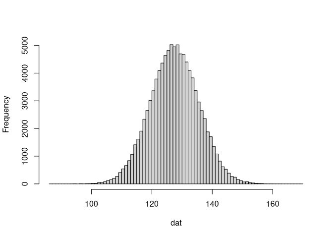

<!-- README.md is generated from README.Rmd. Please edit that file -->

# Ironseed

<!-- badges: start -->

[](https://github.com/reedacartwright/ironseed/actions/workflows/R-CMD-check.yaml)
[](https://app.codecov.io/gh/reedacartwright/ironseed)
[](https://CRAN.R-project.org/package=ironseed)
<!-- badges: end -->

## Overview

Ironseed is an R package that improves seeding for R’s built in random
number generators. An ironseed is a finite-entropy (or fixed-entropy)
hash digest that can be used to generate an unlimited sequence of seeds
for initializing the state of a random number generator. It is inspired
by the work of M.E. O’Neill and others
\[[1](https://www.pcg-random.org/posts/developing-a-seed_seq-alternative.html),
[2](https://www.pcg-random.org/posts/simple-portable-cpp-seed-entropy.html),
[3](https://gist.github.com/imneme/540829265469e673d045)\].

An ironseed is a 256-bit hash digest constructed from a variable-length
sequence of 32-bit inputs. Each ironseed consists of eight 32-bit
sub-digests. The sub-digests are values of 32-bit multilinear hashes
\[[4](https://arxiv.org/pdf/1202.4961)\] that accumulate entropy from
the input sequence. Each input is included in every sub-digest. The
coefficients for the multilinear hashes are generated by a [Weyl
sequence](https://en.wikipedia.org/wiki/Weyl_sequence).

Multilinear hashes are also used to generate an output seed sequence
from an ironseed. Each 32-bit output value is generated by uniquely
hashing the sub-digests. The coefficients for the output are generated
by a second Weyl sequence.

To improve the observed randomness of each hash output, bits are mixed
using a finalizer adapted from SplitMix64
\[[5](https://doi.org/10.1145/2714064.2660195)\]. With the additional
mixing from the finalizer, the output seed sequence passes PractRand
tests \[[6](https://pracrand.sourceforge.net/)\].

## Installation

``` r
# Install the released version of the package from CRAN as usual:
install.packages("ironseed")

# Or the development version from GitHub:
# install.packages("pak")
pak::pak("reedacartwright/ironseed")
```

## Examples

### User Seeding

Ironseed can be used at the top of a script to robustly initialize R’s
builtin random number generator. The resulting ironseed is returned
invisibly, and a message is generated notifying the user that
initialization has occurred. This message can be logged and later used
to reproduce the run.

``` r
#!/usr/bin/env -S Rscript --vanilla
ironseed::ironseed("Experiment", 20251031, 1)
#> ** Ironseed v0.3.0.9000: SetSeed yfTKf9T7KFN-VLKTv4yau2T-GuVxnozmdzS-xQuuK7u3rzG
runif(10)
#>  [1] 0.2260858 0.3481706 0.5172803 0.3832012 0.1827760 0.8723424 0.6730044
#>  [8] 0.3852536 0.4705795 0.9423817
```

If your script is intended to be called multiple times as part of a
large study, you can also seed based on the command line arguments.

``` r
#!/usr/bin/env -S Rscript --vanilla
args <- commandArgs(trailingOnly = TRUE)
ironseed::ironseed("A Simulation Script 1", args)
#> ** Ironseed v0.3.0.9000: SetSeed se9fSTm1mSj-ezcAxkSKY4V-5X2ev6J1VKD-g6pqoyWeyLA
runif(10)
#>  [1] 0.4991457 0.1834726 0.1777406 0.8805143 0.0385879 0.2986159 0.7935945
#>  [8] 0.9421019 0.8711483 0.6693841
```

Specific command line arguments can also be used. For large, nested
studies, it is useful for scripts to support seeding using multiple
seeds. Ironseed makes this easy to accomplish.

``` r
#!/usr/bin/env -S Rscript --vanilla
args <- commandArgs(trailingOnly = TRUE)
ironseed::ironseed("A Simulation Script 2", args[grepl("--seed=", args)])
#> ** Ironseed v0.3.0.9000: SetSeed eYuDcADGbbJ-eA5GJ5zwQyR-rGsw8ddnJnL-Mg2WZhg2d6a
runif(10)
#>  [1] 0.7958163 0.4926650 0.9251130 0.5141941 0.3154608 0.2950173 0.6033356
#>  [8] 0.6048982 0.7448672 0.2704294
```

### Automatic Seeding

Ironseed can also automatically initialize the random number generator
using an ironseed constructed from multiple sources of entropy. This
occurs if no data is passed to `ironseed()`.

``` r
#!/usr/bin/env -S Rscript --vanilla
ironseed::ironseed()
#> ** Ironseed v0.3.0.9000: SetSeed fg79wLi2JWf-rnfWcXpM4b8-ReVLupcewpA-h1YGhTfv5WP
runif(10)
#>  [1] 0.01171726 0.67949220 0.40656326 0.11096005 0.88994860 0.63374079
#>  [7] 0.53135218 0.38782031 0.11618916 0.36079770

# Access the ironseed that was used for RNG seeding.
fe <- ironseed::get_ironseed()
fe
#> Ironseed: fg79wLi2JWf-rnfWcXpM4b8-ReVLupcewpA-h1YGhTfv5WP
```

Or achieving the same thing with one call. Note that the automatically
generated seed is different from the previous run.

``` r
#!/usr/bin/env -S Rscript --vanilla
fe <- ironseed::ironseed()
#> ** Ironseed v0.3.0.9000: SetSeed PbfwvvnYfcb-aeBe9WsroiC-Fx5Pd7btWdP-DeFk4mTFVNg
runif(10)
#>  [1] 0.76992907 0.06944827 0.80863304 0.43426548 0.39184419 0.24245084
#>  [7] 0.85808327 0.81476562 0.17417317 0.80105155
fe
#> Ironseed: PbfwvvnYfcb-aeBe9WsroiC-Fx5Pd7btWdP-DeFk4mTFVNg
```

### Reproducible Code

An ironseed can also be used directly to reproduce a previous
initialization. This is most useful when automatic seeding has been
used, and the previously generated seed has been logged.

``` r
#!/usr/bin/env -S Rscript --vanilla
ironseed::ironseed("RW7vjwjeiHF-QG7RYPvrntR-6tGPoi65sVc-N1n5SQi5RH4")
#> ** Ironseed v0.3.0.9000: SetSeed RW7vjwjeiHF-QG7RYPvrntR-6tGPoi65sVc-N1n5SQi5RH4
runif(10)
#>  [1] 0.94599170 0.35915110 0.75821589 0.91682672 0.62340399 0.19037716
#>  [7] 0.44812890 0.09635376 0.19137057 0.24622360
```

## Analysis

### Avalanche

A good hash function has good avalanche properties. If we change one bit
of information in the input, our goal is to change 50% of the bits in
the output. To test this we, will first build a function to construct a
random pair of ironseeds that differ by a single input bit.

``` r
rand_fe_pair <- function(w) {
  x <- sample(0:1, w, replace = TRUE)
  n <- sample(seq_along(x), 1)
  y <- x
  y[n] <- if (y[n] == 1) 0L else 1L
  x <- packBits(x, "integer")
  y <- packBits(y, "integer")
  x <- ironseed::ironseed(x, set_seed = FALSE)
  y <- ironseed::ironseed(y, set_seed = FALSE)
  list(x = x, y = y)
}
```

Next we will generate 100,000 pairs using 32-bit inputs. We will use R’s
built-in seeding algorithm so that the results are independent of
Ironseed’s seeding algorithm. We will also measure how many hash bits
were flipped by flipping one input bit.

``` r
set.seed(20251220)
z <- replicate(100000, rand_fe_pair(32), simplify = FALSE)
dat <- sapply(z, \(a) sum(intToBits(a$x) != intToBits(a$y)))
```

``` r
mean(dat) # expectation: 128
#> [1] 128.0009
sd(dat) # expectation: 8
#> [1] 8.01368
hist(dat, breaks = 86:170, main = NULL)
```



We will repeat the same analysis for 256-bit inputs.

``` r
set.seed(20251221)
z <- replicate(100000, rand_fe_pair(256), simplify = FALSE)
dat <- sapply(z, \(a) sum(intToBits(a$x) != intToBits(a$y)))
mean(dat) # expectation: 128
#> [1] 128.0145
sd(dat) # expectation: 8
#> [1] 8.005008
hist(dat, breaks = 86:170, main = NULL)
```


As one can see, the avalanche behavior of the input hash is excellent.
